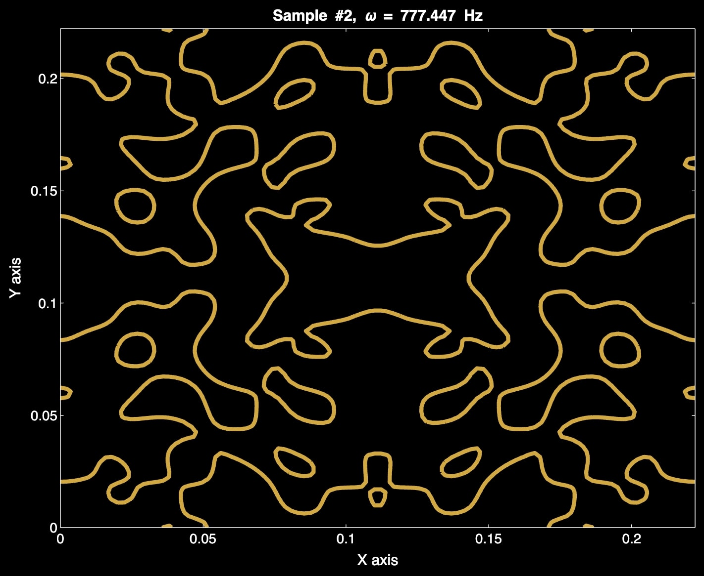

# Chladni Plate Operator Learning Benchmark

This repository contains MATLAB code that generates a **forced Chladni plate** benchmark dataset for **operator learning**.

The code:

1. Defines a 2D rectangular domain \((0, L) \times (0, M)\).
2. Randomly samples a forcing function \(S(x,y)\) in a Fourier-cosine basis via random coefficients \(\alpha(n,m)\).
3. Computes the corresponding plate displacement \(Z(x,y)\) at a fixed time \(t_{\mathrm{fixed}}\) by precomputing integrals associated with the PDE.
4. Stores the forcing fields \(\{S_k\}\) and the resulting solutions \(\{Z_k\}\) in a `.mat` file.

With these \(\{S,Z\}\) data pairs, you can train operator-learning models (e.g., **Fourier Neural Operator**, **DeepONet**, **B2B**, etc.) to learn the mapping \(S \mapsto Z\).

---

## Features

- **Precomputation**  
  The script calculates and caches all terms independent of \(\alpha\) (cosines, time integrals, etc.) for speed.

- **Easy Input/Output**  
  It stores the random coefficients \(\alpha\), forcing \(S\), solution \(Z\), and coordinate grids \((x,y)\) in `.mat` format.

- **Customizable**  
  - Domain dimensions \((L, M)\)
  - Grid resolution (`numPoints`)
  - Number of modes \((n_{\max}, m_{\max})\)
  - Damping and wave parameters \(\gamma, v, \omega\)
  - Number of samples to generate (train/test splitting)
